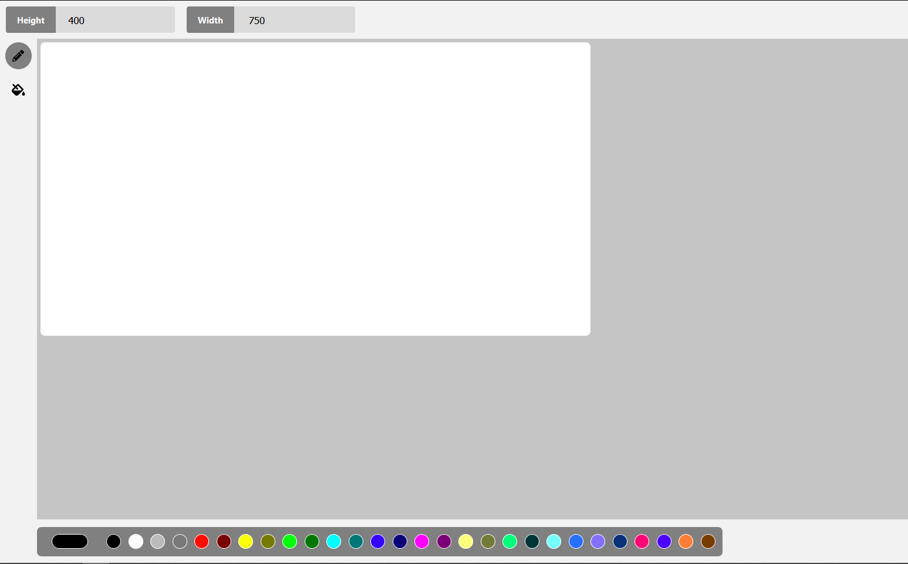

# React MS Paint

## Overview

React MS Paint is a small SPA replica of the Original Mircosoft Paint. This version of MS paint is written in React.js and uses the HTML5 Canvas for the drawing functionality.

## Features

- Color selection
- Pencil tool
- Flood Fill tool
- Canvas Resizing

## Installation & Starting Up

    npm i
    npm start

## To-Do

- Implement Flood Fill Tool

## Used libraries

- React
- node-sass

This project was bootstrapped with [Create React App](https://github.com/facebook/create-react-app).

### Technical Interview Question - Flood Fill

Your task is to create an extremely simple version of the Microsoft Paint application. The application has the following requirements:

    • It must be built using React and run in the browser. ✔️
    • The app should support two tools: pencil, and flood fill. ⌛
    • Those tools will need to support some kind of color picker. We would suggest using an open source package for this. ✔️
    • The canvas should be made up of squares, and be of configurable size. The user should be able to input their desired dimensions for the canvas. You aren’t required to maintain the drawing state when the user changes the canvas size. ✔️
    • The user should be able to use the pencil tool to colour individual squares by clicking on them.
    • You do not need to implement any kind of drag-to-colour feature like is supported by the real pencil tool. (The user will have to click on each square to colour it.) ✔️ (Did it anyway)😏
    • The flood fill tool, should allow the user to fill in all connected squares of the same colour with another colour. ⌛
